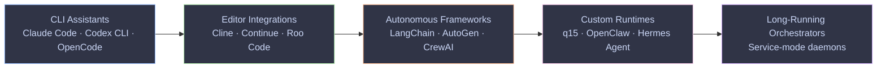
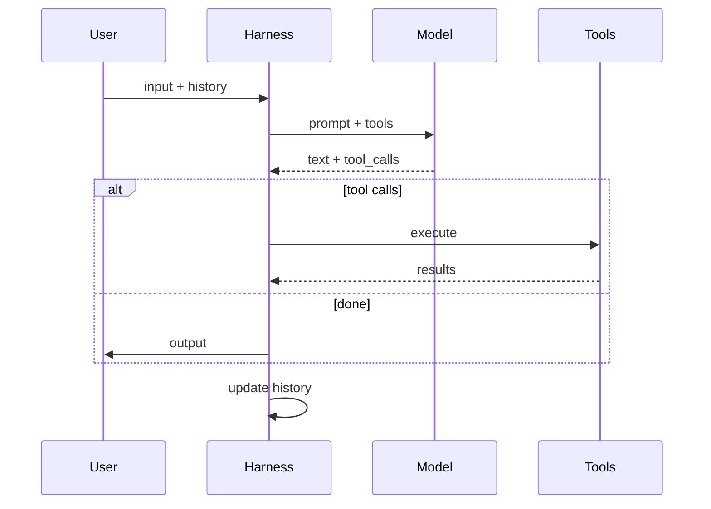
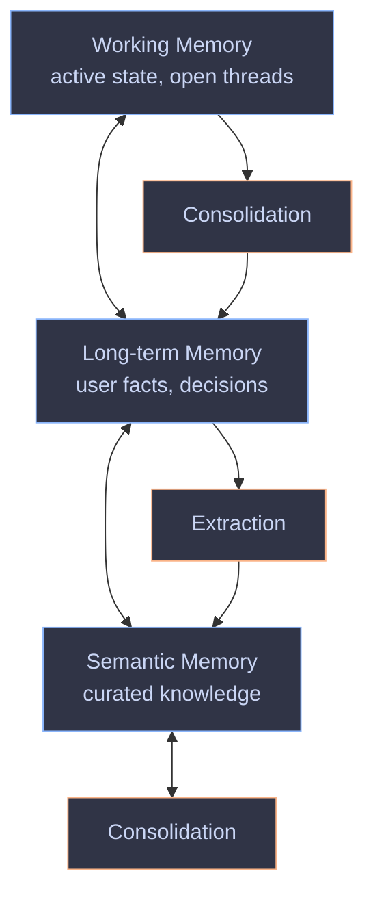

<style>
  :root {
    --slidev-font-family-default: 'Recursive', sans-serif;
    --slidev-font-family-mono: 'Recursive', monospace;
    --slidev-code-font-family: 'Recursive', monospace;
    --recursive-mono: 1;
    --recursive-casl: 0;
    --recursive-slnt: 0;
  }

  .slidev-layout,
  body {
    font-family: 'Recursive', sans-serif;
    font-variation-settings:
      "MONO" var(--recursive-mono, 0),
      "CASL" var(--recursive-casl, 0),
      "slnt" var(--recursive-slnt, 0),
      "wght" 400;
    font-feature-settings: "ss01", "ss02";
  }

  pre code,
  code,
  .slidev-code,
  .shiki {
    font-family: 'Recursive', monospace !important;
    font-variation-settings:
      "MONO" 1,
      "CASL" 0,
      "wght" 450 !important;
  }

  @keyframes recursive-breath {
    0%, 100% { font-variation-settings: "CASL" 0, "MONO" 0, "slnt" 0, "wght" 850; }
    50%      { font-variation-settings: "CASL" 1, "MONO" 0, "slnt" 0, "wght" 850; }
  }

  .title-breath {
    animation: recursive-breath 6s ease-in-out infinite;
    font-family: 'Recursive', sans-serif;
    font-weight: 850;
    letter-spacing: -0.02em;
  }

  svg .node rect,
  svg .node polygon,
  svg .node ellipse {
    transition: filter 0.4s ease;
  }
  svg .node:hover rect,
  svg .node:hover polygon,
  svg .node:hover ellipse {
    filter: brightness(1.15) saturate(1.3);
  }

  svg .node text,
  svg .node .label,
  svg .node.default text,
  svg .node.cli text,
  svg .node.editor text,
  svg .node.framework text,
  svg .node.runtime text,
  svg .node.long text,
  svg .node.q15 text,
  svg .node.mem text,
  svg .node.cog text,
  svg .node.ext text {
    fill: #cad6f5 !important;
    color: #cad6f5 !important;
  }
  svg .edgeLabel text,
  svg .edgeLabel,
  svg .messageText,
  svg text {
    fill: #cad6f5 !important;
  }

  svg.sequenceDiagram,
  svg[id*="sequence"] {
    margin-top: -1rem;
  }
</style>

<script setup>
import { onMounted } from 'vue'
onMounted(() => {
  if (!document.querySelector('link[href*="Recursive"]')) {
    const l = document.createElement('link')
    l.rel = 'stylesheet'
    l.href = 'https://fonts.googleapis.com/css2?family=Recursive:wght@300..1000&family=Recursive:opsz,wght@12..24,300..1000&display=swap'
    document.head.appendChild(l)
  }
})
</script>

# <span class="title-breath">Introduction to Harness Engineering</span>

What a model harness is, why it matters, and what building q15 taught me about the rest of the ecosystem.

<div class="pt-12">
  <span class="px-2 py-1 rounded cursor-pointer" hover="bg-white bg-opacity-10">
    Adriaan van der Bergh · 2026
  </span>
</div>

<div class="abs-br m-6 text-xs opacity-50">
  Press <kbd>space</kbd> for next slide · <kbd>o</kbd> for overview
</div>

<style>
  .slidev-page-1 h1 .title-breath {
    font-size: 52px;
    line-height: 1.05;
    letter-spacing: -0.025em;
  }
</style>
---
layout: default
---

# Code is free

In late 2025, coding agents crossed a threshold. The models can now do the full job of a software engineer — read codebases, write features, run tests, ship patches.

<v-clicks>

<div class="p-4 bg-blue-500 bg-opacity-10 rounded-lg mt-4">

**Implementation is no longer the scarce resource.** Code is free to produce, free to refactor, free to delete. The models are highly parallel and incredibly patient.

</div>

<div class="p-4 bg-green-500 bg-opacity-10 rounded-lg mt-4">

**Every engineer is now a staff engineer.** You have as many team members as you can drive concurrently. Your job is to figure out how to deploy that capacity productively.

</div>

</v-clicks>

<v-click>

<div class="mt-6 text-center text-lg opacity-80">

The question is no longer "can the model do it?" — it's "what do I wrap around the model so it does it <em>reliably</em>?"

</div>

</v-click>
---
layout: default
---

# The three scarce resources

Code is abundant. Three things are not:

<v-clicks>

- **Human time** — your attention is the most expensive thing in the system. Every minute you spend shoulder-surfing the agent is a minute not spent on higher-leverage work.

- **Human and model attention** — the model can only hold so much context at once. Making things the same across the codebase reduces the attention the model needs to activate per task.

- **Model context window** — a fixed, finite buffer. If the conversation grows too long, something has to be dropped. How you handle this is the hardest problem in harness engineering.

</v-clicks>

<v-click>

<div class="mt-6 p-4 bg-purple-500 bg-opacity-10 rounded-lg text-sm">

Your role shifts from <em>writing code</em> to <em>building systems that enable agents to write code</em>: structures, guardrails, feedback loops, and memory that make the agent reliable without you watching.

</div>

</v-click>
---
layout: default
---

# What is a model harness?

The idea was articulated by Mitchell Hashimoto and formalized by Ryan Lopopolo at OpenAI in early 2026.

<v-clicks>

A model API gives you text-in / text-out. That's it. No tools, no memory, no loop, no error handling.

A **harness** is everything you wrap around that API to make it actually *do things*: system prompts, tools, the agent loop, model selection, output parsing, error recovery, history management.

</v-clicks>

<v-click>

<div class="mt-4 text-center text-2xl font-bold">

Agent = Model + Harness

</div>

<div class="mt-2 text-center text-sm opacity-70">

The model is the brain. The harness is the body. Without the body, the brain just thinks.

</div>

</v-click>
---
layout: default
---

# How I ended up building one

I installed OpenClaw and used it for a bit. It was great — until I realized it was running arbitrary code on my machine.

<v-clicks>

I wanted to make it useful: web access, a GitHub account, maybe an email address, bash commands. Without those, an agent is useless.

But I didn't want it running in an environment with my API keys.

</v-clicks>

<v-click>

I looked at PicoClaw (also Go). Same problem — the agent needs to run code where your credentials live in the environment.

</v-click>

<v-clicks>

Then I had an idea: a **man-in-the-middle proxy** that injects credentials at the network layer. The agent never sees the keys. I tested it. It worked.

So I thought: why not just build the whole harness? You have models to help you build it. And if you build your own, you add exactly the features you want.

</v-clicks>
---
layout: default
---

# Why build your own?

<v-clicks>

OpenClaw, PicoClaw, Hermes — they're **general-purpose software**. They need to support every chat client, every integration, every deployment model. The codebases are massive.

If you build your own agent, you only add the features **you** need. The codebase stays smaller and more manageable.

</v-clicks>

<v-click>

<div class="mt-6 p-4 bg-blue-500 bg-opacity-10 rounded-lg text-sm">

You have models that can write code. You have a clear idea of what your agent should do. The marginal cost of building your own harness is lower than the cost of understanding someone else's 50,000-line runtime.

</div>

</v-click>
---
layout: default
---

# The harness spectrum

Same primitives, different opinions about **who** runs it, **where** it runs, and **how much** it can do on its own.



<v-click>

<div class="mt-4 text-sm opacity-80">

The arrow is **not** "better than." It's "more autonomous, more infrastructure, more moving parts." A CLI assistant is the right answer for most developer workflows. A custom runtime is the right answer when you're shipping a product.

</div>

</v-click>
---
layout: default
---

# The agent loop — same shape everywhere

Every harness, from Claude Code to q15, runs the same loop:



<v-clicks>

- The differences are in **what counts as a tool**, **how long the loop runs**, **what gets remembered**
- The model never sees the loop — it sees one turn at a time
- Everything else — context assembly, tool dispatch, error handling, memory — is the harness

</v-clicks>
---
layout: default
---

# Making things legible to agents

The loop only works if the model can read the repo, the tools, and the rules. That's **legibility**.

<v-clicks>

- **Rules files** (AGENTS.md, CLAUDE.md) — persistent, repo-scoped instructions injected into the agent's context at session start
- **Skills** — reusable workflow packages with instructions, scripts, and references
- **Structural tests** — tests *about* the source code: file length limits, module boundary checks, dependency constraints

</v-clicks>

<v-click>

<div class="mt-6 p-4 bg-blue-500 bg-opacity-10 rounded-lg text-sm">

**In q15**, skills are first-class: markdown-defined directories under <code>/skills</code>, version-controlled, portable across deployments. The agent reads them when relevant and follows the procedures. Built-in skills ship with the runtime; shared skills persist on your infrastructure.

</div>

</v-click>
---
layout: two-cols
layoutClass: gap-8
---

# Everything is a prompt

Ryan Lopopolo's key insight: every way you influence the agent is a prompt.

<v-clicks>

- System prompts are prompts
- Rules files (AGENTS.md) are prompts
- Skills are prompts
- **Lint error messages are prompts**
- Review agent comments are prompts

</v-clicks>

<v-click>

A good lint error doesn't say "violation detected." It says:

</v-click>

::right::

<div class="ml-8 mt-12">

```typescript
// Lint error: use logger.info({event: 'name', ...data})
// instead of console.log. See AGENTS.md §logging.
// Do not use console.log in production code.
console.log("user logged in")
```

<v-click>

<div class="mt-6 text-sm opacity-80">

The error message itself becomes a prompt — the agent reads it and fixes the violation without human intervention.

</div>

<div class="mt-4 text-sm opacity-80">

**Disable inline-disable rules** (<code>// eslint-disable-next-line</code>) — otherwise agents suppress violations instead of fixing them.

</div>

</v-click>

</div>
---
layout: default
---

# Durable solutions to failure classes

When an agent makes a mistake, engineer a solution so it never makes that mistake again.

<v-clicks>

1. **Observe** — find the durable classes of failures, not the one-off bugs
2. **Diagnose** — figure out why the agent is struggling in your environment
3. **Engineer** — write a lint, a test, a skill, or a review agent that catches it
4. **Step back** — move to higher-leverage work once the guardrail is in place

</v-clicks>

<v-click>

<div class="mt-6 p-4 bg-purple-500 bg-opacity-10 rounded-lg text-sm">

**In q15**, this is systematized as <strong>cognition jobs</strong> — background processes that run after every turn:

- **Verification review** — a separate model checks the agent's work against evidence. Verdict: pass, fail, or partial.
- **Working memory consolidation** — compacts active state, removes stale entries, preserves open threads.
- **Semantic memory extraction** — pulls durable facts, preferences, and project knowledge into structured files.

Each job can run on a different model than the interactive loop. The harness thinks about its own work while you're not looking.

</div>

</v-click>
---
layout: default
---

# The context window problem

Every LLM has a fixed context window. When the conversation grows too long, something has to be dropped.

<v-clicks>

The standard approach is **compaction**: when the transcript exceeds a threshold, the harness asks the model to summarize the older portion. The summary replaces the original messages.

Problems:
- **Lossy** — you cannot query what was lost. If the model omitted a detail, it's gone from the prompt.
- **Compounding drift** — each cycle summarizes the previous summary. After three cycles, detail erodes.
- **Blocking** — compaction happens during the user's turn. The model is asked to summarize *before* it can answer.

</v-clicks>

<v-click>

<div class="mt-4 text-center text-lg opacity-80">

The hardest part of a harness isn't calling the model. It's <em>what to remember, when to forget, and how to keep it consistent across sessions.</em>

</div>

</v-click>
---
layout: default
---

# Memory as architecture — q15's approach

q15 doesn't compress history. It maintains **structured memory artifacts** through background cognition jobs.



<v-clicks>

- The full transcript persists on disk. Nothing is deleted. Only the recent **unconsolidated** turns replay into the prompt.
- **Working memory** = what the harness knows. **Cognition** = what it does with it.
- **One conversation. No sessions. No "new chat" button.** The agent picks up where you left off because its memory persists across the gap.

</v-clicks>
---
layout: two-cols
layoutClass: gap-8
---

# Security as harness engineering — the proxy idea, realized

Remember the proxy idea? That became q15's architecture.

Most AI agent platforms run everything in one process: the model, the tools, the credentials, and the network all share a trust domain.

If the model is compromised via prompt injection, the attacker has everything.

<v-click>

q15 splits the harness into three services with hard boundaries:

</v-click>

::right::

<div class="ml-8 mt-4">

<v-clicks>

- **`q15-agent`** — prompt assembly, tool wiring, memory, file operations. **Never sees credentials.**
- **`q15-exec`** — command execution through Nix. **The egress boundary.** All outbound traffic routes through the proxy.
- **`q15-proxy`** — credential injection at the network layer. **The only service with secrets.**

</v-clicks>

<v-click>

<div class="mt-6 p-4 bg-red-500 bg-opacity-10 rounded-lg text-sm">

The agent cannot ask exec to bypass the proxy. The routing is configured at the deployment level. A compromised prompt cannot exfiltrate secrets the agent never had.

This removes the easiest exfiltration path. It doesn't eliminate every attack vector — but it turns prompt injection from "game over" into a contained problem.

</div>

</v-click>

</div>
---
layout: default
---

# Model selection is a harness concern

The harness decides which model to call — not the user, not the model.

<v-clicks>

- **Capability inference** — the harness inspects the request: does it need tools? reasoning? vision? It filters models by what they can actually do.
- **Fallback ordering** — remaining models are tried in configured order. Cheap models first to minimize cost. Capable models first for best quality. Local models first to avoid cloud calls.
- **Cognition model selection** — background jobs use a separate model list. Verification on a careful model, consolidation on a fast one.

</v-clicks>

<v-click>

<div class="mt-6 text-sm opacity-80">

The model API is the smallest piece. Everything else — provider abstraction, capability matching, fallback, error recovery — <em>is the harness.</em> A harness that abstracts over providers is doing real work. It can't just be a 10-line wrapper.

</div>

</v-click>
---
layout: default
---

# Stacking leverage

The leverage you encode into your harness stacks. Each guardrail you build pays forward to every future agent run.

<v-clicks>

- One engineer documents a QA plan → every agent trajectory gets a good QA plan
- A review agent asserts expectations → trust increases → you shoulder-surf less
- A lint with remediation messages → the agent self-corrects without human input
- A skill captures a workflow → the next agent run starts from the skill, not from zero

</v-clicks>

<v-click>

<div class="mt-6 text-center text-lg opacity-80">

Build the guardrail once. It works forever.

</div>

</v-click>
---
layout: default
---

# Who holds the state?

<v-clicks>

- In a CLI harness, the **user** holds the state across runs. You remember what happened. You open the right chat. You manage the context.

- In a long-running agent runtime, the **harness** holds the state across users. It remembers. It manages context. It figures out what to keep and what to forget.

</v-clicks>

<v-click>

<div class="mt-6 p-4 bg-blue-500 bg-opacity-10 rounded-lg">

That's why memory and cognition matter — the agent has to figure out what to remember **on its own**. Without structured memory and background cognition, the agent starts from zero every time.

</div>

</v-click>

<v-click>

<div class="mt-6 text-center text-xl opacity-80">

The model is the easy part. The harness is the actual product.

</div>

</v-click>
---
layout: default
---

# What I'd recommend

A pragmatic answer for whoever's listening:

<v-clicks>

- **For personal dev work** → Claude Code or Codex CLI. Don't over-think it.
- **For pair-programming in the IDE** → Cline or Continue. The diff-first UX is genuinely good.
- **For understanding** → build a 50-line harness yourself. One model, one tool, one loop. Everything else becomes obvious.
- **For shipping a product** → build your own harness. You have models to help you write it. Add only the features you need. The codebase stays small, and you understand every line.
- **For long-running agents** → make sure your harness treats memory + cognition as first-class. Otherwise you'll bolt it on later and it will be messy.

</v-clicks>

<div v-click class="mt-8 text-center text-2xl opacity-80">

When an agent makes a mistake, don't fix the mistake. Engineer a solution so it never makes that mistake again.

</div>
---
layout: center
class: text-center
---

# Thanks

<div class="text-lg opacity-80 mt-4">

Happy to dig into any of this in detail. Bring questions.

</div>

<div class="grid grid-cols-2 gap-8 mt-12 text-left max-w-2xl mx-auto">
  <div class="p-4 bg-blue-500 bg-opacity-10 rounded-lg">
    <div class="font-bold mb-2">q15</div>
    <div class="text-sm opacity-70">github.com/q15co/q15</div>
    <div class="text-sm opacity-70">Open-source, Go, portable</div>
  </div>
  <div class="p-4 bg-purple-500 bg-opacity-10 rounded-lg">
    <div class="font-bold mb-2">Me</div>
    <div class="text-sm opacity-70">Adriaan van der Bergh</div>
    <div class="text-sm opacity-70">adesso SE · Düsseldorf</div>
  </div>
</div>

<div class="mt-12 text-xs opacity-50">

Built with [Slidev](https://sli.dev) · images via fal.ai · video via HyperFrames

Talk outline based on Ryan Lopopolo's "Harness Engineering" (OpenAI, 2026) · [openai.com/index/harness-engineering](https://openai.com/index/harness-engineering)

</div>