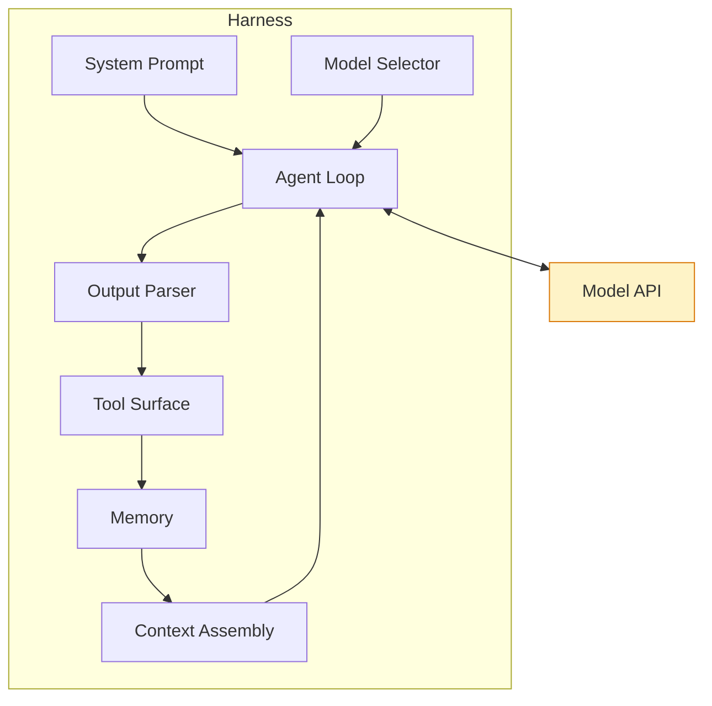
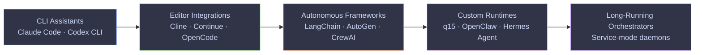
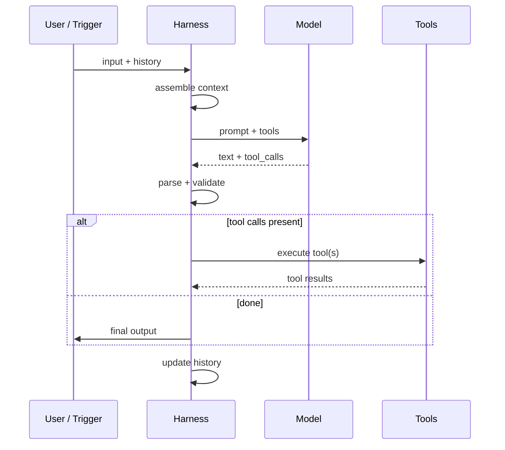
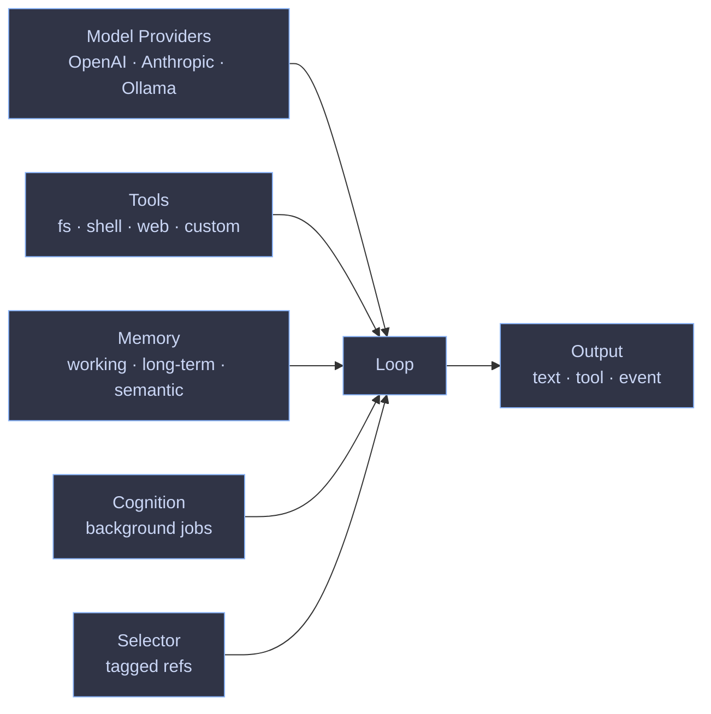
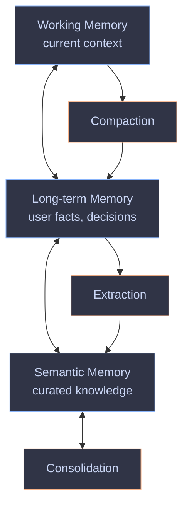

<style>
  :root {
    --slidev-font-family-default: 'Recursive', sans-serif;
    --slidev-font-family-mono: 'Recursive', monospace;
    --slidev-code-font-family: 'Recursive', monospace;
    /* Exercise Recursive axes: set MONO to 1 for code, default casual for body */
    --recursive-mono: 1;
    --recursive-casl: 0;
    --recursive-slnt: 0;
  }

  /* Apply Recursive variable axes */
  .slidev-layout,
  body {
    font-family: 'Recursive', sans-serif;
    font-variation-settings:
      "MONO" var(--recursive-mono, 0),
      "CASL" var(--recursive-casl, 0),
      "slnt" var(--recursive-slnt, 0),
      "wght" 400;
    font-feature-settings: "ss01", "ss02";
  }

  pre code,
  code,
  .slidev-code,
  .shiki {
    font-family: 'Recursive', monospace !important;
    font-variation-settings:
      "MONO" 1,
      "CASL" 0,
      "wght" 450 !important;
  }

  /* Subtle animation on the title slide: animate Recursive CASL axis to slide
     between Casual (0) and Casual (1), creating a breathing effect */
  @keyframes recursive-breath {
    0%, 100% { font-variation-settings: "CASL" 0, "MONO" 0, "slnt" 0, "wght" 850; }
    50%      { font-variation-settings: "CASL" 1, "MONO" 0, "slnt" 0, "wght" 850; }
  }

  .title-breath {
    animation: recursive-breath 6s ease-in-out infinite;
    font-family: 'Recursive', sans-serif;
    font-weight: 850;
    letter-spacing: -0.02em;
  }

  /* Hover-triggered axis animation on Mermaid diagrams */
  svg .node rect,
  svg .node polygon,
  svg .node ellipse {
    transition: filter 0.4s ease;
  }
  svg .node:hover rect,
  svg .node:hover polygon,
  svg .node:hover ellipse {
    filter: brightness(1.15) saturate(1.3);
  }

  /* Mermaid contrast fix: force light-text on the dark surface fills
     we just chose, regardless of what Slidev's runtime computes. */
  svg .node text,
  svg .node .label,
  svg .node.default text,
  svg .node.cli text,
  svg .node.editor text,
  svg .node.framework text,
  svg .node.runtime text,
  svg .node.long text,
  svg .node.q15 text,
  svg .node.mem text,
  svg .node.cog text,
  svg .node.ext text {
    fill: #cad6f5 !important;
    color: #cad6f5 !important;
  }
  svg .edgeLabel text,
  svg .edgeLabel,
  svg .messageText,
  svg text {
    fill: #cad6f5 !important;
  }

  /* Shrink sequence diagrams a touch and lift them so the bottom
     loop ("update history") doesn't clip. */
  svg.sequenceDiagram,
  svg[id*="sequence"] {
    margin-top: -1.5rem;
    transform: scale(0.95);
    transform-origin: top center;
  }
</style>

<script setup>
import { onMounted } from 'vue'
onMounted(() => {
  // Load Recursive variable font from Google Fonts with all axes
  if (!document.querySelector('link[href*="Recursive"]')) {
    const l = document.createElement('link')
    l.rel = 'stylesheet'
    l.href = 'https://fonts.googleapis.com/css2?family=Recursive:wght@300..1000&family=Recursive:opsz,wght@12..24,300..1000&display=swap'
    document.head.appendChild(l)
  }
})
</script>

# <span class="title-breath">Introduction to Harness Engineering</span>

A tour through the model harness layer, told through what I learned building q15

<div class="pt-12">
  <span class="px-2 py-1 rounded cursor-pointer" hover="bg-white bg-opacity-10">
    Adriaan van der Bergh · 2026
  </span>
</div>

<div class="abs-br m-6 text-xs opacity-50">
  Press <kbd>space</kbd> for next slide · <kbd>o</kbd> for overview
</div>

<style>
  /* Cover (slide 1) — title is long, so reduce h1 size a touch so
     it wraps cleanly inside the slide canvas */
  .slidev-page-1 h1 .title-breath {
    font-size: 52px;
    line-height: 1.05;
    letter-spacing: -0.025em;
  }
</style>
---
layout: default
---

# Why this talk

I started building **q15** — an open-source AI agent runtime in Go — partly because I wanted to understand what an AI agent actually *is* at the substrate level.

What I kept running into: every project, every demo, every blog post used the word **harness**. Claude Code was a harness. Cline was a harness. OpenClaw was a harness. And q15, it turned out, was a harness too.

This talk is what I learned mapping that space, and why I now think "harness engineering" is a useful lens for anyone shipping AI work.

<v-clicks>

- The term is everywhere and rarely defined
- Building one forces you to learn what every other one does
- The pattern is universal — even long-running agents are harnesses
- Once you see the layer, you stop reinventing it badly

</v-clicks>
---
layout: two-cols
layoutClass: gap-8
---

# What is a model harness?

A model API gives you text-in / text-out. That's it. No tools, no memory, no loop, no error handling, no idea what "done" means.

A **harness** is the code you wrap around that API to make it actually *do things*.

It's the system prompt, the tool surface, the message loop, the model selection, the output parser, the error recovery, the history management. The model is the brain. The harness is the body.

::right::


---
layout: default
---

# Why do we need one?

The model gives you a brain in a jar. To do anything in the world, that brain needs:

<v-clicks>

1. **A way to express intent** — system prompt, instructions, persona
2. **Tools** — file system, shell, search, HTTP, custom domain actions
3. **A loop** — keep calling the model until the task is done (and know when it's done)
4. **Context** — what just happened, what's true now, what's been tried
5. **Error handling** — tools fail, models hallucinate, networks drop
6. **Model selection** — the right brain for the right sub-task, possibly many of them

</v-clicks>

<div v-click class="mt-8 p-4 bg-blue-500 bg-opacity-10 rounded-lg">

**The pattern**: every useful AI application builds these six things. The only question is whether you build them yourself or pick up someone else's harness.

</div>
---
layout: default
---

# The harness spectrum

Same primitives, different opinion. Each category makes different trade-offs about **who** runs it, **where** it runs, and **how much** it can do on its own.



<v-click>

<div class="mt-6 text-sm opacity-80">

The arrow is **not** "better than." It's "more autonomous, more infrastructure, more moving parts." A CLI assistant is the right answer for most developer workflows. A custom runtime is the right answer when you're shipping a product.

</div>

</v-click>
---
layout: default
---

# What a harness actually does

The agent loop, universal shape:



<v-clicks>

- **Same shape** across every harness I looked at
- The differences are in **what counts as a tool**, **how long the loop runs**, **what gets remembered**
- The model never sees the loop — it sees one turn at a time

</v-clicks>
---
layout: two-cols
---

# CLI assistants

**Claude Code, Codex CLI**

Terminal-first. Single binary. Optimised for the developer who lives in a shell.

<v-clicks>

- Heavy on opinionated UX (slash commands, file diffs, headless mode)
- Read-only by default; tool calls are explicit
- "Senior engineer with a terminal" mental model
- Best for: writing code, refactors, exploring codebases
- Worst for: long-running autonomous work

</v-clicks>

::right::

<div class="ml-8 mt-12">

```bash {*|2|3|4|5|6}{lines:true}
$ claude "refactor this file to use the
    new error handling pattern"

Reading 4 files...
I'll make these changes:
  src/auth.ts (rewrite)
  src/auth.test.ts (update)
  src/middleware.ts (touch)

Apply? [y/n/r] y
✓ Applied
```

</div>
---
layout: two-cols
---

# Editor integrations

**Cline, Continue, OpenCode**

Editor-first. Sidebar UI, diff visualisation, model picker.

<v-clicks>

- See what the model is doing, in real time, in the IDE
- Diffs are the primary UI primitive
- Often a thin shell over an OpenAI-compatible API
- Best for: pair-programming style workflows
- Worst for: anything outside the editor (no terminal-first reach)

</v-clicks>

::right::

<div class="ml-8 mt-12">

```
┌─ Cline ──────────────────┐
│                          │
│ Add error handling to    │
│ the auth middleware.     │
│                          │
│ ✓ Read auth.ts           │
│ ✓ Read auth.test.ts      │
│ → Patch auth.ts          │
│   + if (!token) {        │
│     throw new Error(...) │
│   }                      │
│                          │
│ [Apply] [Reject] [Skip]  │
└──────────────────────────┘
```

</div>
---
layout: default
---

# Agent runtimes

**OpenClaw, Hermes Agent, q15**

Headless. Designed to run as services or embedded in products. Less about "watch the agent work," more about "give the agent work."

<v-clicks>

- API-driven, not UI-driven
- Multi-agent by default (planner, executor, critic)
- Memory is a first-class concept
- Configuration > conversation: YAML, code, or both
- Best for: production products, autonomous workflows
- Worst for: ad-hoc dev work where you want to steer in real time

</v-clicks>

<div v-click class="mt-6 grid grid-cols-3 gap-4 text-sm">
  <div class="p-3 bg-blue-500 bg-opacity-10 rounded">
    <div class="font-bold">OpenClaw</div>
    <div class="opacity-70">Distributed agent platform · opinionated about deployment</div>
  </div>
  <div class="p-3 bg-pink-500 bg-opacity-10 rounded">
    <div class="font-bold">Hermes Agent</div>
    <div class="opacity-70">Lightweight runtime · focuses on tool semantics</div>
  </div>
  <div class="p-3 bg-purple-500 bg-opacity-10 rounded">
    <div class="font-bold">q15</div>
    <div class="opacity-70">Portable agent runtime · Go · memory + cognition as primitives</div>
  </div>
</div>
---
layout: default
---

# What building q15 taught me

The story in one slide:



<v-clicks>

- The model API is the smallest piece. Everything else *is* the harness.
- Memory is the part that makes a runtime interesting
- Cognition (background summarisation, consolidation) is the part that makes it *durable*
- Provider abstraction (OpenAI-compat) means you stop caring which model is on the other end

</v-clicks>
---
layout: default
---

# Long-running orchestration agents

Same primitives. Different lifecycle.

<v-clicks>

- The harness becomes a **daemon**: runs as a service, holds state across requests
- Memory crosses session boundaries — that's the whole point
- Cognition runs in the background: compaction, extraction, consolidation
- Multiple loops can share providers, memory, tools
- "Did this ever happen?" stops being a question you can only answer with logs

</v-clicks>

<div v-click class="mt-8 p-4 bg-purple-500 bg-opacity-10 rounded-lg text-sm">

**Mental shift**: in a CLI harness, the *user* holds the state across runs. In a long-running orchestration agent, the *harness* holds the state across users. That's why cognition matters — the agent has to figure out what to remember on its own.

</div>
---
layout: default
---

# Model providers — the OpenAI-compat layer

Most providers now speak a version of OpenAI's chat completions API.

```typescript {*|2,3|5,6|8,9|11}{lines:true}
const openai = new OpenAI({ apiKey: process.env.OPENAI_API_KEY })
const anthropic = new OpenAI({
  baseURL: 'https://api.anthropic.com/v1',  // same client
  apiKey: process.env.ANTHROPIC_API_KEY,
})
const ollama = new OpenAI({
  baseURL: 'http://localhost:11434/v1',     // local model
  apiKey: 'ollama',
})
const deepseek = new OpenAI({
  baseURL: 'https://api.deepseek.com/v1',
  apiKey: process.env.DEEPSEEK_API_KEY,
})
```

<v-click>

The harness doesn't care which provider. Same `client.chat.completions.create(...)` call. Same response shape. Same tool-calling convention (mostly).

</v-click>

<div v-click class="mt-6 text-sm opacity-80">

**The catch**: tool calling, system prompts, and structured output vary subtly between providers. The harness that abstracts over them is doing real work — it can't just be a 10-line wrapper.

</div>
---
layout: default
---

# Memory + cognition — single source of truth

The hardest part of a harness isn't calling the model. It's **what to remember, when to forget, and how to keep it consistent across sessions.**



<v-clicks>

- **Memory** is what the harness knows (facts, state, history)
- **Cognition** is what the harness does with that knowledge (summarise, extract, consolidate, prune)
- Together they form the agent's "self" — the thing that makes session N+1 not start from zero

</v-clicks>

<div v-click class="mt-6 p-4 bg-blue-500 bg-opacity-10 rounded-lg text-sm">

**The mental model**: memory is the database. Cognition is the daemon that runs `cron` on it. Without cognition, memory grows forever and becomes noise.

</div>
---
layout: default
---

# What I'd recommend

A pragmatic answer for whoever's listening:

<v-clicks>

- **For personal dev work** → Claude Code or Codex CLI. Don't over-think it.
- **For pair-programming in the IDE** → Cline or OpenCode. The diff-first UX is genuinely good.
- **For understanding** → build a 50-line harness yourself. One model, one tool, one loop. Everything else becomes obvious.
- **For shipping a product** → pick an agent runtime (q15, Hermes, OpenClaw) and stop reinventing orchestration.
- **For long-running agents** → make sure the runtime treats memory + cognition as first-class. Otherwise you'll bolt it on later and it will be messy.

</v-clicks>

<div v-click class="mt-8 text-center text-2xl opacity-80">

**The thing to remember**: the model is the easy part. The harness is the actual product.

</div>
---
layout: center
class: text-center
---

# Thanks

<div class="text-lg opacity-80 mt-4">

Happy to dig into any of this in detail. Bring questions.

</div>

<div class="grid grid-cols-2 gap-8 mt-12 text-left max-w-2xl mx-auto">
  <div class="p-4 bg-blue-500 bg-opacity-10 rounded-lg">
    <div class="font-bold mb-2">q15</div>
    <div class="text-sm opacity-70">github.com/q15co/q15</div>
    <div class="text-sm opacity-70">Open-source, Go, portable</div>
  </div>
  <div class="p-4 bg-purple-500 bg-opacity-10 rounded-lg">
    <div class="font-bold mb-2">Me</div>
    <div class="text-sm opacity-70">Adriaan van der Bergh</div>
    <div class="text-sm opacity-70">adesso SE · Düsseldorf</div>
  </div>
</div>

<div class="mt-12 text-xs opacity-50">

Built with [Slidev](https://sli.dev) · images via fal.ai · video via HyperFrames

</div>
