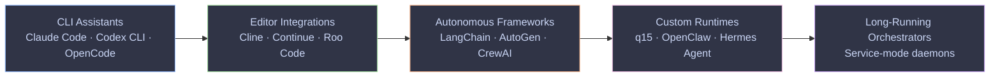
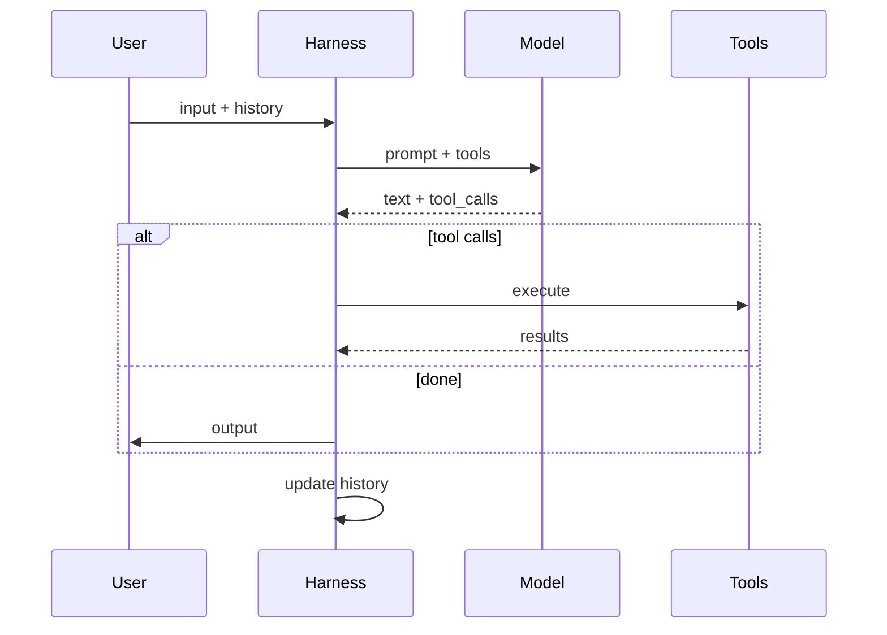
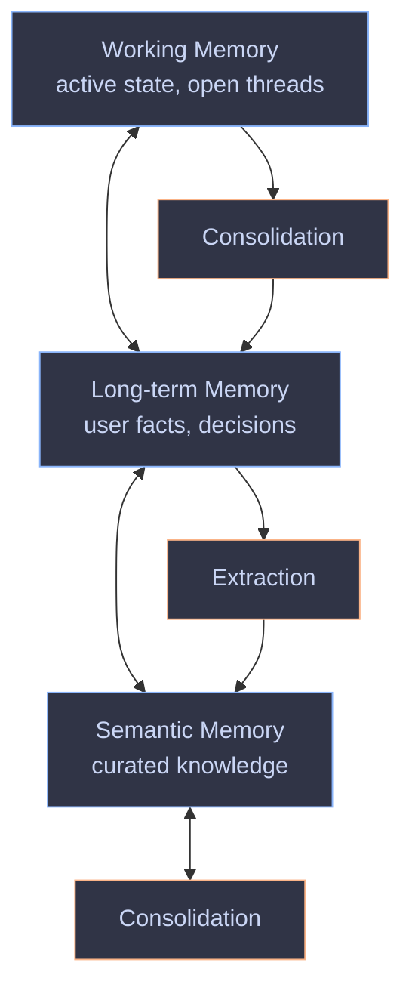

<style>
  :root {
    --slidev-font-family-default: 'Recursive', sans-serif;
    --slidev-font-family-mono: 'Recursive', monospace;
    --slidev-code-font-family: 'Recursive', monospace;
    --recursive-mono: 1;
    --recursive-casl: 0;
    --recursive-slnt: 0;
  }

  .slidev-layout,
  body {
    font-family: 'Recursive', sans-serif;
    font-variation-settings:
      "MONO" var(--recursive-mono, 0),
      "CASL" var(--recursive-casl, 0),
      "slnt" var(--recursive-slnt, 0),
      "wght" 400;
    font-feature-settings: "ss01", "ss02";
  }

  pre code,
  code,
  .slidev-code,
  .shiki {
    font-family: 'Recursive', monospace !important;
    font-variation-settings:
      "MONO" 1,
      "CASL" 0,
      "wght" 450 !important;
  }

  @keyframes recursive-breath {
    0%, 100% { font-variation-settings: "CASL" 0, "MONO" 0, "slnt" 0, "wght" 850; }
    50%      { font-variation-settings: "CASL" 1, "MONO" 0, "slnt" 0, "wght" 850; }
  }

  .title-breath {
    animation: recursive-breath 6s ease-in-out infinite;
    font-family: 'Recursive', sans-serif;
    font-weight: 850;
    letter-spacing: -0.02em;
  }

  svg .node rect,
  svg .node polygon,
  svg .node ellipse {
    transition: filter 0.4s ease;
  }
  svg .node:hover rect,
  svg .node:hover polygon,
  svg .node:hover ellipse {
    filter: brightness(1.15) saturate(1.3);
  }

  svg .node text,
  svg .node .label,
  svg .node.default text,
  svg .node.cli text,
  svg .node.editor text,
  svg .node.framework text,
  svg .node.runtime text,
  svg .node.long text,
  svg .node.q15 text,
  svg .node.mem text,
  svg .node.cog text,
  svg .node.ext text {
    fill: #cad6f5 !important;
    color: #cad6f5 !important;
  }
  svg .edgeLabel text,
  svg .edgeLabel,
  svg .messageText,
  svg text {
    fill: #cad6f5 !important;
  }

  svg.sequenceDiagram,
  svg[id*="sequence"] {
    margin-top: -1rem;
  }
</style>

<script setup>
import { onMounted } from 'vue'
onMounted(() => {
  if (!document.querySelector('link[href*="Recursive"]')) {
    const l = document.createElement('link')
    l.rel = 'stylesheet'
    l.href = 'https://fonts.googleapis.com/css2?family=Recursive:wght@300..1000&family=Recursive:opsz,wght@12..24,300..1000&display=swap'
    document.head.appendChild(l)
  }
})
</script>

# <span class="title-breath">Introduction to Harness Engineering</span>

What it is. Why it matters. What building q15 taught me.

<div class="pt-12">
  <span class="px-2 py-1 rounded cursor-pointer" hover="bg-white bg-opacity-10">
    Adriaan van der Bergh · 2026
  </span>
</div>

<div class="abs-br m-6 text-xs opacity-50">
  Press <kbd>space</kbd> for next slide · <kbd>o</kbd> for overview
</div>

<style>
  .slidev-page-1 h1 .title-breath {
    font-size: 52px;
    line-height: 1.05;
    letter-spacing: -0.025em;
  }
</style>
<!--
Welcome the audience. Brief intro: who I am, what this talk is about.

This is a talk about harness engineering — what it means, why it matters, and what building my own agent runtime taught me about the rest of the ecosystem.

The talk is based on Ryan Lopopolo's "Harness Engineering" talk from OpenAI, with additional ideas from Mario Zechner's work on Pi.

Keep this brief — 30 seconds max. The real content starts on the next slide.
-->
---
layout: default
---

# Code is free

<v-clicks>

<div class="p-4 bg-blue-500 bg-opacity-10 rounded-lg mt-4">

**Implementation is no longer the scarce resource.**

</div>

<div class="p-4 bg-green-500 bg-opacity-10 rounded-lg mt-4">

**Every engineer is now a staff engineer.**

</div>

</v-clicks>

<v-click>

<div class="mt-6 text-center text-lg opacity-80">

What do I wrap around the model so it does it **reliably**?

</div>

</v-click>
<!--
Open with the thesis: coding agents crossed a threshold in late 2025. Models can now do the full job of a software engineer — read codebases, write features, run tests, ship patches.

[click] Emphasize that implementation is no longer the bottleneck. Code is free to produce, refactor, delete. The models are parallel and patient.

[click] The key shift: every engineer is now effectively a staff engineer. You have as many team members as you can drive concurrently. Your job is deploying that capacity.

[click] Land the central question: it's not "can the model do it?" but "what do I wrap around the model so it does it reliably?" That's the whole talk in one sentence.

Transition: "So if code is free, what's actually scarce? Three things."
-->
---
layout: default
---

# Three things are not free

<v-clicks>

- **Human time** — your attention is the bottleneck

- **Model attention** — consistency across the codebase reduces load

- **Context window** — fixed, finite. The hardest problem.

</v-clicks>

<v-click>

<div class="mt-6 text-center text-lg opacity-80">

Your job: <em>build systems that make agents reliable</em> — not write code.

</div>

</v-click>
<!--
Frame this as the economic shift: code is abundant, but three things are not.

[click] Walk through each scarce resource:
- Human time — your attention is the most expensive thing. Shoulder-surfing the agent is not scalable.
- Human and model attention — consistency across the codebase reduces the attention the model needs per task. This is why conventions matter.
- Context window — fixed, finite. This is the hardest problem and we'll come back to it.

[click] The role shift: you're no longer writing code, you're building systems that enable agents to write code. Structures, guardrails, feedback loops, memory.

Transition: "So what exactly is the thing you're building? Let's define it."
-->
---
layout: default
---

# What is a model harness?

<v-clicks>

Model API: text-in, text-out. That's it.

**Harness** = everything else: prompts, tools, loop, memory, error recovery

</v-clicks>

<v-click>

<div class="mt-6 text-center text-2xl font-bold">

Agent = Model + Harness

</div>

</v-click>
<!--
Define the core concept. The idea was articulated by Mitchell Hashimoto and formalized by Ryan Lopopolo at OpenAI.

[click] Start from first principles: a model API gives you text-in, text-out. Nothing else. No tools, no memory, no loop, no error handling. That's the raw material.

A harness is everything you wrap around that API to make it actually do things: system prompts, tools, the agent loop, model selection, output parsing, error recovery, history management.

[click] The formula: Agent = Model + Harness. The model is the brain, the harness is the body. Without the body, the brain just thinks. This is the one-sentence takeaway for the whole talk.

Transition: "How did I end up building one? It wasn't planned."
-->
---
layout: default
---

# How I ended up building one

<v-clicks>

- OpenClaw → arbitrary code on my machine

- Wanted: web, GitHub, email, bash

- Didn't want: API keys in the agent's env

- PicoClaw → same problem

</v-clicks>

<v-click>

<div class="mt-4 p-4 bg-green-500 bg-opacity-10 rounded-lg text-sm">

**Idea:** a proxy that injects credentials at the network layer. The agent never sees the keys.

</div>

</v-click>

<v-click>

<div class="mt-4 text-center text-lg opacity-80">

Why not build the whole harness?

</div>

</v-click>
<!--
This is the origin story — keep it personal and authentic.

[click] I installed OpenClaw and used it. It was great — until I realized it was running arbitrary code on my machine.

I wanted to make it useful: web access, GitHub, email, bash. Without those, an agent is useless. But I didn't want API keys in the agent's environment.

[click] I looked at PicoClaw — same Go ecosystem, same problem. The agent needs to run code where your credentials live.

[click] Then the key idea: a man-in-the-middle proxy that injects credentials at the network layer. The agent never sees the keys. I tested it. It worked.

So I thought: why not build the whole harness? You have models to help you build it. And if you build your own, you add exactly the features you want.

Transition: "But why build your own instead of using an existing one?"
-->
---
layout: default
---

# Why build your own?

<v-clicks>

- General-purpose runtimes: massive codebases, every integration

- Your own: only the features **you** need

- Marginal cost < understanding someone else's 50k lines

</v-clicks>

<v-click>

<div class="mt-6 p-4 bg-green-500 bg-opacity-10 rounded-lg text-sm">

Mario Zechner: <em>"My context wasn't my context."</em>

</div>

</v-click>

<v-click>

<div class="mt-4 text-sm opacity-70">

Their harness controls your context. System prompts change. Tools get removed. Reminders get injected.

</div>

</v-click>
<!--
[click] The argument for building your own: existing runtimes are general-purpose software. They support every chat client, every integration, every deployment. The codebases are massive.

If you build your own, you only add what you need. The codebase stays smaller and more manageable.

[click] The cost argument: you have models that write code, you know what your agent should do. The marginal cost of building your own is lower than understanding someone else's 50,000-line runtime.

[click] Mario Zechner's point: "My context wasn't my context." When you use someone else's harness, they control your context. System prompts change on every release, tools get removed, system reminders get injected behind your back. This is a sovereignty argument — who controls the agent's perception of the world?

Transition: "So where does q15 sit in the landscape? Let's map the spectrum."
-->
---
layout: default
---

# The harness spectrum



<v-click>

<div class="mt-4 text-sm opacity-80">

Not "better than." More autonomous, more infrastructure, more moving parts.

</div>

</v-click>
<!--
Show the spectrum. Same primitives, different opinions about who runs it, where it runs, and how autonomous it is.

Walk through the categories left to right: CLI assistants, editor integrations, autonomous frameworks, custom runtimes, long-running orchestrators. Name a few examples in each.

[click] Emphasize: the arrow is NOT "better than." It's "more autonomous, more infrastructure, more moving parts." A CLI assistant is the right answer for most developer workflows. A custom runtime is the right answer when you're shipping a product. Context matters.

Transition: "Underneath all of these, the same loop is running."
-->
---
layout: default
---

# The agent loop — same shape everywhere



<v-clicks>

- Differences: **tools**, **loop length**, **what's remembered**
- Model sees one turn at a time
- Everything else is the harness

</v-clicks>
<!--
Show the universal pattern. Every harness, from Claude Code to q15, runs the same loop.

Walk through the sequence diagram: user sends input, harness assembles prompt and sends to model, model responds with text and/or tool calls, harness executes tools or returns output, history is updated.

[click] The differences are in what counts as a tool, how long the loop runs, and what gets remembered. The model never sees the loop — it sees one turn at a time. Everything else — context assembly, tool dispatch, error handling, memory — is the harness.

Transition: "So how minimal can this loop actually be?"
-->
---
layout: default
---

# How minimal can a harness be?

<v-clicks>

<div class="p-4 bg-blue-500 bg-opacity-10 rounded-lg mt-4">

**Terminus** — 2 tools: keystrokes + read. Outperforms harnesses with dozens.

</div>

</v-clicks>

<v-click>

<div class="p-4 bg-green-500 bg-opacity-10 rounded-lg mt-4 text-sm">

**Pi** — 4 tools: read, write, edit, bash. System prompt: a few lines.

</div>

</v-click>

<v-click>

<div class="mt-6 text-center text-lg opacity-80">

We're in the "around and find out" phase.

</div>

</v-click>
<!--
[click] Terminus on Terminal Bench: two tools — send keystrokes to tmux, read output. No file tools, no sub-agents, no plan mode. It outperforms harnesses with dozens of tools. This is a striking result.

[click] Mario Zechner's Pi: four tools — read, write, edit, bash. System prompt is a few lines. His argument: the models are already trained to be coding agents. You don't need 10,000 tokens to tell them what they are.

[click] Land the meta-point: we're in the "around and find out" phase of coding agents. Their current form is not their final form. Don't over-invest in one approach.

Transition: "Whatever tools you give the agent, it needs to be able to read the rules."
-->
---
layout: default
---

# Making things legible to agents

<v-clicks>

- **Rules files** — AGENTS.md, CLAUDE.md

- **Skills** — reusable workflow packages

- **Structural tests** — tests *about* the source code

</v-clicks>

<v-click>

<div class="mt-6 text-sm opacity-80">

In q15: skills are first-class — version-controlled, portable, markdown-defined.

</div>

</v-click>
<!--
The loop only works if the model can read the repo, the tools, and the rules. That's legibility.

[click] Walk through the three mechanisms:
- Rules files (AGENTS.md, CLAUDE.md) — persistent, repo-scoped instructions injected at session start
- Skills — reusable workflow packages with instructions, scripts, references
- Structural tests — tests about the source code itself: file length limits, module boundary checks, dependency constraints

[click] In q15, skills are first-class: markdown directories under /skills, version-controlled, portable. The agent reads them when relevant and follows the procedures.

Transition: "Lopopolo's key insight ties all of this together: everything is a prompt."
-->
---
layout: two-cols
layoutClass: gap-8
---

# Everything is a prompt

<v-clicks>

- System prompts
- Rules files
- Skills
- **Lint errors are prompts**

</v-clicks>

<v-click>

A good lint error says what to do, not "violation detected."

</v-click>

::right::

<div class="ml-8 mt-12">

```typescript
// Lint error: use logger.info({event: 'name', ...data})
// instead of console.log. See AGENTS.md §logging.
// Do not use console.log in production code.
console.log("user logged in")
```

<v-click>

<div class="mt-6 text-sm opacity-80">

The error message becomes a prompt — the agent fixes it without human input.

</div>

</v-click>

</div>
<!--
[click] Lopopolo's insight: every way you influence the agent is a prompt. System prompts, rules files, skills — and crucially, lint error messages and review comments.

[click] Show the code example: a good lint error doesn't say "violation detected." It tells the agent what to do instead, references the rules, and explains why. The error message itself becomes a prompt — the agent reads it and fixes the violation without human intervention.

[click] Practical tip: disable inline-disable rules. Otherwise agents suppress violations instead of fixing them. This is a real pattern — agents will happily add eslint-disable comments.

Transition: "This leads to the most important habit: durable solutions to failure classes."
-->
---
layout: default
---

# Durable solutions to failure classes

<v-clicks>

1. **Observe** — failure classes, not one-off bugs
2. **Diagnose** — why the agent struggles here
3. **Engineer** — lint, test, skill, or review agent
4. **Step back** — move to higher-leverage work

</v-clicks>

<v-click>

<div class="mt-6 text-sm opacity-80">

In q15: **cognition jobs** — verification, consolidation, extraction. Each on a different model.

</div>

</v-click>
<!--
The core engineering discipline: when an agent makes a mistake, don't just fix it. Engineer a solution so it never makes that mistake again.

[click] Walk through the four steps:
1. Observe — find the durable classes of failures, not one-off bugs
2. Diagnose — figure out why the agent struggles in your environment
3. Engineer — write a lint, a test, a skill, or a review agent that catches it
4. Step back — move to higher-leverage work once the guardrail is in place

[click] In q15, this is systematized as cognition jobs — background processes that run after every turn: verification review, working memory consolidation, semantic memory extraction. Each can run on a different model. The harness thinks about its own work while you're not looking.

Transition: "But all of this runs inside a fixed context window. That's the hardest problem."
-->
---
layout: default
---

# The context window problem

<v-clicks>

Standard approach: **compaction** — summarize old turns, replace with summary.

Problems:

- **Lossy** — gone is gone
- **Drift** — summaries of summaries erode detail
- **Blocking** — stalls the user's turn

</v-clicks>

<v-click>

<div class="mt-6 text-center text-lg opacity-80">

The hardest part: <em>what to remember, when to forget, how to stay consistent.</em>

</div>

</v-click>
<!--
[click] Every LLM has a fixed context window. When the conversation grows too long, something has to be dropped.

The standard approach is compaction: when the transcript exceeds a threshold, the harness asks the model to summarize the older portion. The summary replaces the original messages.

Walk through the three problems:
- Lossy — you can't query what was lost. If the model omitted a detail, it's gone from the prompt.
- Compounding drift — each cycle summarizes the previous summary. After three cycles, detail erodes.
- Blocking — compaction happens during the user's turn. The model is asked to summarize before it can answer.

[click] Land the takeaway: the hardest part of a harness isn't calling the model. It's what to remember, when to forget, and how to keep it consistent across sessions.

Transition: "Here's how q15 approaches this differently."
-->
---
layout: default
---

# Memory as architecture — q15's approach



<v-clicks>

- Full transcript persists on disk. Nothing deleted.
- Working memory = what it knows. Cognition = what it does.
- **One conversation. No "new chat" button.**

</v-clicks>
<!--
q15 doesn't compress history. It maintains structured memory artifacts through background cognition jobs.

Walk through the diagram: working memory (active state) ↔ long-term memory (facts, decisions) ↔ semantic memory (curated knowledge). Consolidation and extraction jobs move information between layers.

[click] Key points:
- The full transcript persists on disk. Nothing is deleted. Only recent unconsolidated turns replay into the prompt.
- Working memory = what the harness knows. Cognition = what it does with it.
- One conversation. No sessions. No "new chat" button. The agent picks up where you left off because memory persists across the gap.

Transition: "Before we wrap up, there's one more piece — the one that started this whole project."
-->
---
layout: two-cols
layoutClass: gap-8
---

# Security — the proxy idea, realized

<v-clicks>

Most platforms: one process, one trust domain.

Prompt injection → attacker has everything.

</v-clicks>

<v-click>

q15: three services, hard boundaries.

</v-click>

::right::

<div class="ml-8 mt-4">

<v-clicks>

- **`q15-agent`** — never sees credentials
- **`q15-exec`** — the egress boundary
- **`q15-proxy`** — the only service with secrets

</v-clicks>

<v-click>

<div class="mt-6 p-4 bg-red-500 bg-opacity-10 rounded-lg text-sm">

Prompt injection: **contained**, not game over.

</div>

</v-click>

</div>
<!--
[click] Remember the proxy idea from the origin story? That became q15's architecture.

The problem: most AI agent platforms run everything in one process — model, tools, credentials, network all share a trust domain. If the model is compromised via prompt injection, the attacker has everything.

[click] q15 splits into three services with hard boundaries:
- q15-agent — prompt assembly, tool wiring, memory, file operations. Never sees credentials.
- q15-exec — command execution through Nix. The egress boundary. All outbound traffic routes through the proxy.
- q15-proxy — credential injection at the network layer. The only service with secrets.

[click] The key insight: the agent cannot ask exec to bypass the proxy. Routing is configured at deployment level. A compromised prompt cannot exfiltrate secrets the agent never had. This turns prompt injection from "game over" into a contained problem. It doesn't eliminate every attack vector, but it removes the easiest exfiltration path.

Transition: "Another harness concern: which model do you actually call?"
-->
---
layout: default
---

# Model selection is a harness concern

<v-clicks>

- **Capability inference** — tools? reasoning? vision?
- **Fallback ordering** — cheap first, or capable first
- **Cognition models** — separate list for background jobs

</v-clicks>

<v-click>

<div class="mt-6 text-sm opacity-80">

The model API is the smallest piece. Everything else is the harness.

</div>

</v-click>
<!--
[click] The harness decides which model to call — not the user, not the model.

Walk through the three layers:
- Capability inference — the harness inspects the request: tools? reasoning? vision? It filters models by what they can actually do.
- Fallback ordering — remaining models tried in configured order. Cheap first for cost, capable first for quality, local first to avoid cloud.
- Cognition model selection — background jobs use a separate model list. Verification on a careful model, consolidation on a fast one.

[click] The model API is the smallest piece. Everything else — provider abstraction, capability matching, fallback, error recovery — is the harness. A harness that abstracts over providers is doing real work. It can't just be a 10-line wrapper.

Transition: "And all of this stacks."
-->
---
layout: default
---

# Stacking leverage

<v-clicks>

- QA plan → every trajectory benefits
- Review agent → trust increases → less shoulder-surfing
- Lint with remediation → agent self-corrects
- Skill captures workflow → next run starts from skill

</v-clicks>

<v-click>

<div class="mt-6 text-center text-lg opacity-80">

Build the guardrail once. It works forever.

</div>

</v-click>
<!--
[click] The leverage you encode into your harness stacks. Each guardrail pays forward to every future agent run.

Walk through the examples:
- One engineer documents a QA plan → every agent trajectory gets a good QA plan
- A review agent asserts expectations → trust increases → you shoulder-surf less
- A lint with remediation messages → the agent self-corrects without human input
- A skill captures a workflow → the next agent run starts from the skill, not from zero

[click] The one-liner: build the guardrail once, it works forever. This is the compounding return on harness engineering.

Transition: "There's one more architectural question that separates the toys from the products."
-->
---
layout: default
---

# Who holds the state?

<v-clicks>

- **CLI harness**: the **user** holds state — you remember, you manage context

- **Agent runtime**: the **harness** holds state — it remembers, it forgets

</v-clicks>

<v-click>

<div class="mt-6 text-center text-xl opacity-80">

Without structured memory, the agent starts from zero every time.

</div>

</v-click>

<v-click>

<div class="mt-4 text-center text-xl opacity-80">

The model is the easy part. The harness is the actual product.

</div>

</v-click>
<!--
[click] The question: who holds the state across runs?

In a CLI harness, the user holds the state. You remember what happened, you open the right chat, you manage the context. This works for individual workflows.

[click] In a long-running agent runtime, the harness holds the state across users. It remembers, manages context, figures out what to keep and what to forget. That's why memory and cognition matter — the agent has to figure out what to remember on its own.

[click] Without structured memory and background cognition, the agent starts from zero every time. The model is the easy part. The harness is the actual product.

Transition: "Before you go build all of this — Mario has a warning."
-->
---
layout: default
---

# Slow the fuck down

<v-clicks>

Agents compound errors — zero learning, delayed pain. The pain is for you.

- Blanks in specs → filled with internet garbage
- Agent-written tests are not trustworthy
- When it breaks, who do you call? You haven't read the code.

</v-clicks>

<v-click>

<div class="mt-6 p-4 bg-red-500 bg-opacity-10 rounded-lg text-sm">

**Critical code: read every line.** The friction is where you build understanding.

</div>

</v-click>
<!--
[click] This is the counterpoint to all the leverage talk. Mario Zechner's warning: agents compound errors — he calls them "booboos" — with zero learning, no bottlenecks, and delayed pain. The pain is for you.

Walk through the three hard truths:
- A sufficiently detailed spec is a program. If you leave blanks, the model fills them with garbage it learned from the internet. 90% of code on the internet is old garbage.
- Agent-written tests are not trustworthy. You cannot trust your codebase if you haven't read the code.
- When something breaks and your users are screaming, who are you going to call? Not yourself — you haven't read the code.

[click] The closing message: think about what you're building and why. Learn to say no. Fewer features, but the ones that matter. Cap the amount of generated code you need to review. Critical code: read every line. The friction is where you build understanding in your head — and it's where you learn new things.

Transition: "That's the talk. Thanks."
-->
---
layout: center
class: text-center
---

# Thanks

<div class="text-lg opacity-80 mt-4">

Happy to dig into any of this in detail. Bring questions.

</div>

<div class="grid grid-cols-2 gap-8 mt-12 text-left max-w-2xl mx-auto">
  <div class="p-4 bg-blue-500 bg-opacity-10 rounded-lg">
    <div class="font-bold mb-2">q15</div>
    <div class="text-sm opacity-70">github.com/q15co/q15</div>
    <div class="text-sm opacity-70">Open-source, Go, portable</div>
  </div>
  <div class="p-4 bg-purple-500 bg-opacity-10 rounded-lg">
    <div class="font-bold mb-2">Me</div>
    <div class="text-sm opacity-70">Adriaan van der Bergh</div>
    <div class="text-sm opacity-70">adesso SE · Düsseldorf</div>
  </div>
</div>

<div class="mt-12 text-xs opacity-50">

Built with [Slidev](https://sli.dev) · images via fal.ai · video via HyperFrames

Talk outline based on Ryan Lopopolo's "Harness Engineering" (OpenAI) · [openai.com/index/harness-engineering](https://openai.com/index/harness-engineering)
Additional ideas from Mario Zechner's "Building Pi in a World of Slop" · [youtube.com/watch?v=RjfbvDXpFls](https://www.youtube.com/watch?v=RjfbvDXpFls)

</div>

<!--
Thank the audience. Invite questions. Mention the repo and that q15 is open-source.

Keep this warm and brief — don't rush off. Let people know you're happy to dig into any of the topics in detail.

If someone asks about attribution: the talk outline is based on Ryan Lopopolo's "Harness Engineering" talk at OpenAI, with additional ideas from Mario Zechner's "Building Pi in a World of Slop."
-->