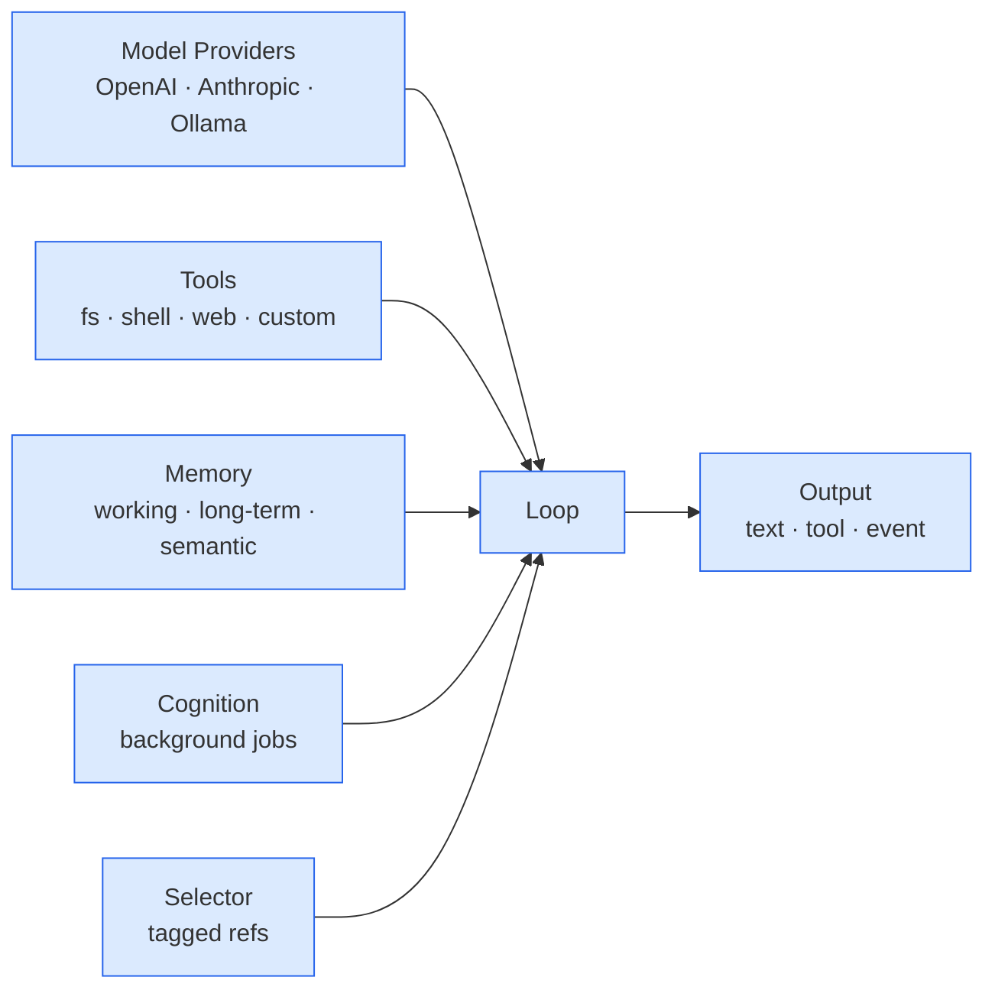

# What building q15 taught me

The story in one slide:

<v-clicks>

- The model API is the smallest piece. Everything else *is* the harness.
- Memory is the part that makes a runtime interesting
- Cognition (background summarisation, consolidation) is the part that makes it *durable*
- Provider abstraction (OpenAI-compat) means you stop caring which model is on the other end

</v-clicks>