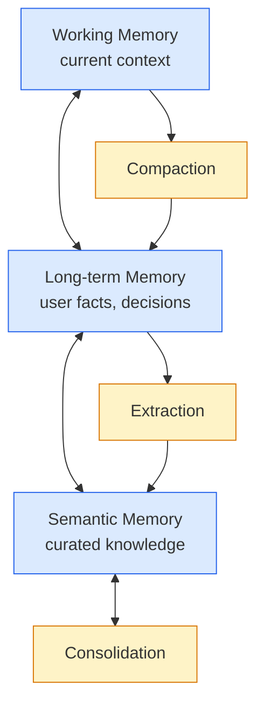

# Memory + cognition — single source of truth

The hardest part of a harness isn't calling the model. It's **what to remember, when to forget, and how to keep it consistent across sessions.**

<v-clicks>

- **Memory** is what the harness knows (facts, state, history)
- **Cognition** is what the harness does with that knowledge (summarise, extract, consolidate, prune)
- Together they form the agent's "self" — the thing that makes session N+1 not start from zero

</v-clicks>

**The mental model**: memory is the database. Cognition is the daemon that runs `cron` on it. Without cognition, memory grows forever and becomes noise.

