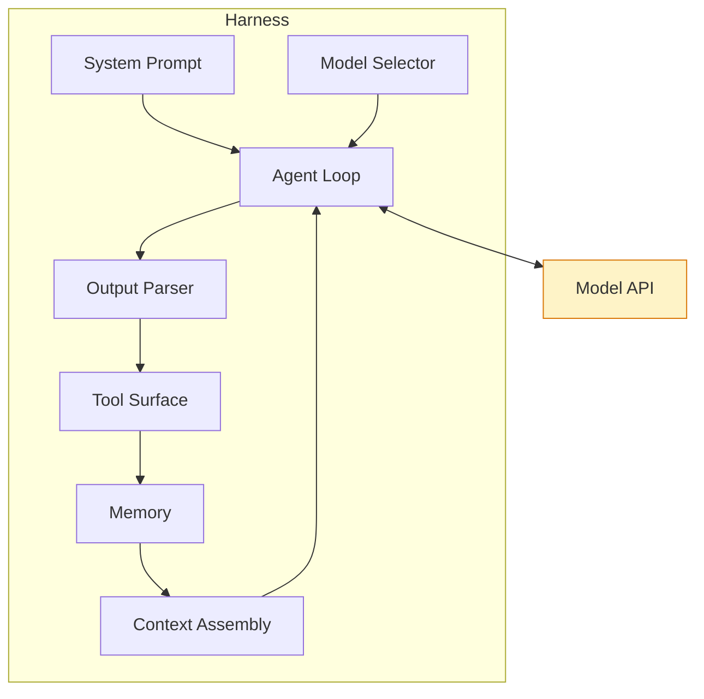

# What is a model harness?

A model API gives you text-in / text-out. That's it. No tools, no memory, no loop, no error handling, no idea what "done" means.

A **harness** is the code you wrap around that API to make it actually *do things*.

It's the system prompt, the tool surface, the message loop, the model selection, the output parser, the error recovery, the history management. The model is the brain. The harness is the body.

::right::

