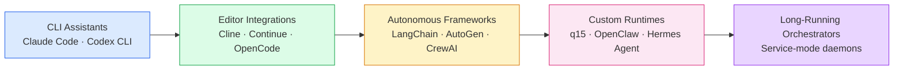

# The harness spectrum

Same primitives, different opinion. Each category makes different trade-offs about **who** runs it, **where** it runs, and **how much** it can do on its own.

<v-click>

The arrow is **not** "better than." It's "more autonomous, more infrastructure, more moving parts." A CLI assistant is the right answer for most developer workflows. A custom runtime is the right answer when you're shipping a product.

