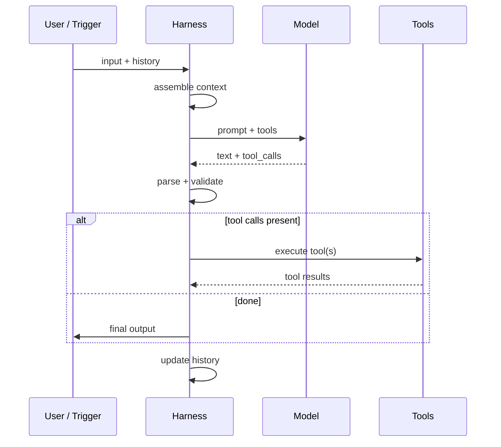

# What a harness actually does

The agent loop, universal shape:

<v-clicks>

- **Same shape** across every harness I looked at
- The differences are in **what counts as a tool**, **how long the loop runs**, **what gets remembered**
- The model never sees the loop — it sees one turn at a time

</v-clicks>